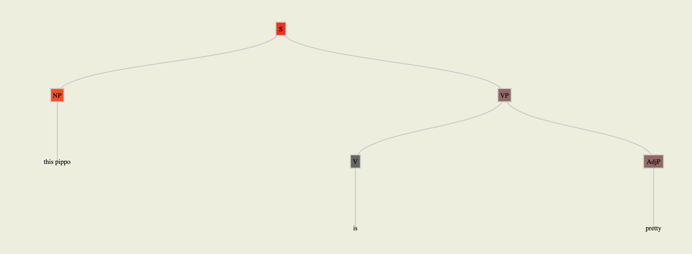

tree-activations-viewer
===========

A visualization tool based on [d3.js](http://d3js.org/) that allow you to visualize DTK tree activations:

```
(S:0.5 (NP:0.6 this pippo) (VP:0.3 (V:0.2 is) (AdjP:0.3 pretty)))
```



## Usage
Open `index.html` with your browser.
